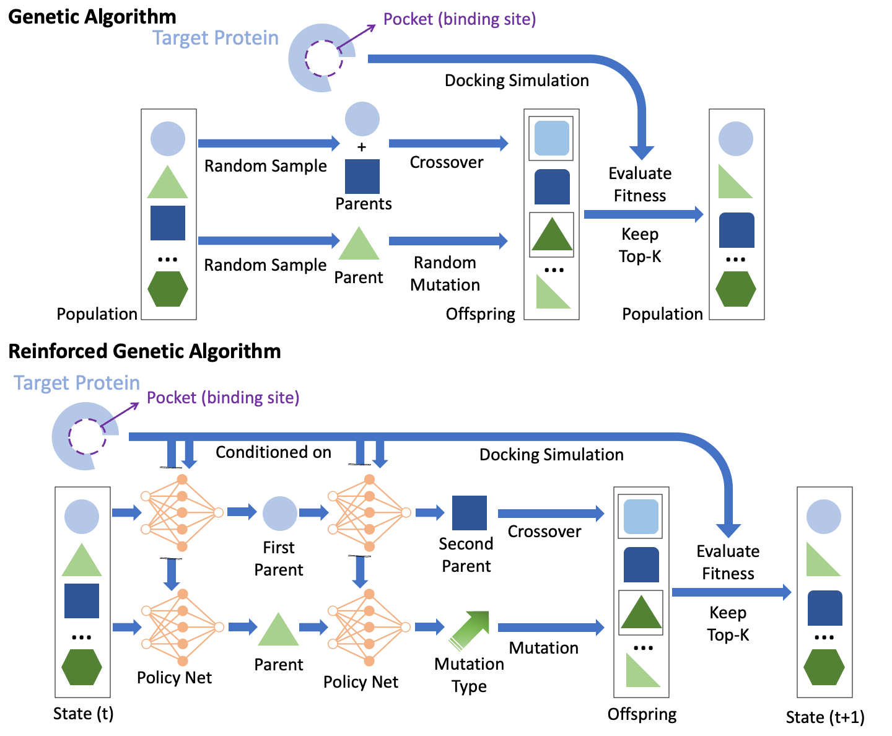

# reinforced genetic algorithm for structure-based drug design

This repository is for our recent NeurIPS 2022 paper: Reinforced Genetic Algorithm for Structure-based Drug Design. 


The paper proposes a reinforcement learning-based genetic algorithm for structure-based drug design. 
This is the first successful attempt to use a neural model to guide the crossover and mutation operations in a genetic algorithm to suppress random-walk behavior and explore the chemical space intelligently. 
The following figure illustrate the difference between genetic algorithm and reinforced genetic algorithm. 


<p align="center"></p>


## Problem: structure-based Drug Design


Rapid drug discovery that requires less time and cost is of significant interest in pharmaceutical science. Structurebased drug design (SBDD) that leverages the three-dimensional (3D) structures of the diseaserelated proteins to design drug candidates is one primary approach to accelerate the drug discovery processes with
physical simulation and data-driven modeling. According to the lock and key model, the molecules that bind tighter to a disease target are more likely to expose bioactivity against the disease, which has been verified experimentally. 
As AlphaFold2 has provided accurate predictions to most human proteins [3], SBDD has a tremendous opportunity to discover new drugs for new targets that we cannot model before [2]. 


## Traditional genetic algorithm (GA)

Traditional combinatorial optimization methods such as genetic algorithms (GA) have demonstrated state-of-the-art performance in various molecular optimization tasks. However, they do not utilize protein target structure to inform design steps but rely on a random-walk-like exploration, which leads to unstable performance and no knowledge transfer between different tasks despite the similar binding physics.


## Reinforced genetic algorithm (RGA)


To achieve a more stable and efficient SBDD, we propose Reinforced genetic algorithm (RGA) that uses neural models to prioritize the profitable design steps and suppress random-walk behavior. 
The neural models take the 3D structure of the targets and ligands as inputs and are pre-trained using native complex structures to utilize the knowledge of the shared binding physics from different targets and then fine-tuned during optimization. 
Specifically, we propose an evolutionary Markov decision process (EMDP) that reformulates an evolutionary process as a Markov decision process, where the state is a population of molecules instead of a single molecule. 


## Setup 

### conda install
```bash
conda create -n autogrow --file rga.yml 
```


### conda activation 
```bash
conda activate autogrow 
```

### download mgltools 

download [mgltools](https://ccsb.scripps.edu/mgltools/downloads/). then install mgltools

```bash
tar -zxvf xxx.tar.gz 
cd mgltools_x86_64Linux2_1.5.6
./install.sh 
cd .. 
```


## Run 


```
python RGA.py \
    --filename_of_receptor ./tutorial/PARP/4r6eA_PARP1_prepared.pdb \
    --center_x -70.76 --center_y  21.82 --center_z 28.33 \
    --size_x 25.0 --size_y 16.0 --size_z 25.0 \
    --source_compound_file ./source_compounds/naphthalene_smiles.smi \
    --root_output_folder ./output \
    --number_of_mutants_first_generation 50 \
    --number_of_crossovers_first_generation 50 \
    --number_of_mutants 50 \
    --number_of_crossovers 50 \
    --top_mols_to_seed_next_generation 50 \
    --number_elitism_advance_from_previous_gen 50 \
    --number_elitism_advance_from_previous_gen_first_generation 10 \
    --diversity_mols_to_seed_first_generation 10 \
    --diversity_seed_depreciation_per_gen 10 \
    --num_generations 5 \
    --mgltools_directory ./mgltools_x86_64Linux2_1.5.6/ \
    --number_of_processors -1 \
    --scoring_choice VINA \
    --LipinskiLenientFilter \
    --start_a_new_run \
    --rxn_library click_chem_rxns \
    --selector_choice Rank_Selector \
    --dock_choice VinaDocking \
    --max_variants_per_compound 5 \
    --redock_elite_from_previous_gen False \
    --generate_plot True \
    --reduce_files_sizes True \
    --use_docked_source_compounds True  
```


