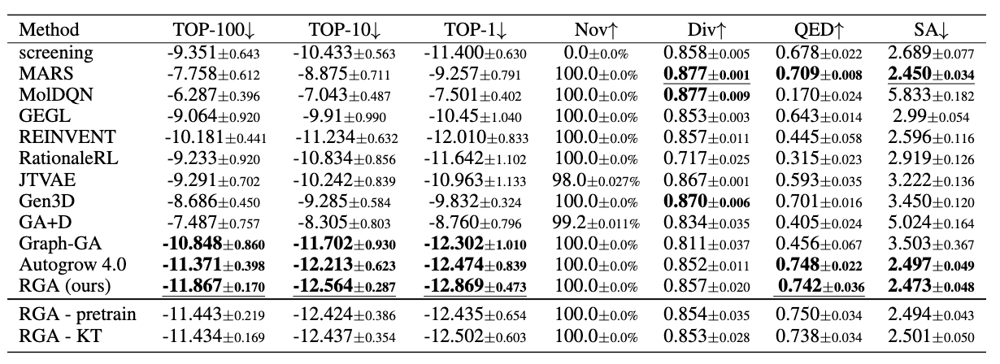

# reinforced genetic algorithm for structure-based drug design

This blog is written to introduce our recent NeurIPS 2022 paper [1]: Reinforced Genetic Algorithm for Structure-based Drug Design. 

The paper proposes a reinforcement learning-based genetic algorithm for structure-based drug design. 

## Problem: structure-based Drug Design

Rapid drug discovery that requires less time and cost is of significant interest in pharmaceutical science. Structurebased drug design (SBDD) that leverages the three-dimensional (3D) structures of the diseaserelated proteins to design drug candidates is one primary approach to accelerate the drug discovery processes with
physical simulation and data-driven modeling. According to the lock and key model (Tripathi & Bankaitis, 2017), the molecules that bind tighter to a disease target are more likely to expose bioactivity against the disease, which has been verified experimentally (Alon et al., 2021). As AlphaFold2 has provided accurate predictions to most human proteins (Jumper et al., 2021; Varadi et al., 2022), SBDD has a tremendous opportunity to discover new drugs for new targets that we cannot model before (Ren et al., 2022).

## genetic algorithm

## reinforced genetic algorithm

## Experiment

We report the optimization performance of all the methods as follows. 

We have open-sourced our code in https://github.com/futianfan/reinforced-genetic-algorithm.

## References

[1] Tianfan Fu*, Wenhao Gao*, Connor W. Coley, Jimeng Sun. Reinforced Genetic Algorithm for Structure-based Drug Design. Neural Information Processing Systems (NeurIPS) 2022. 

