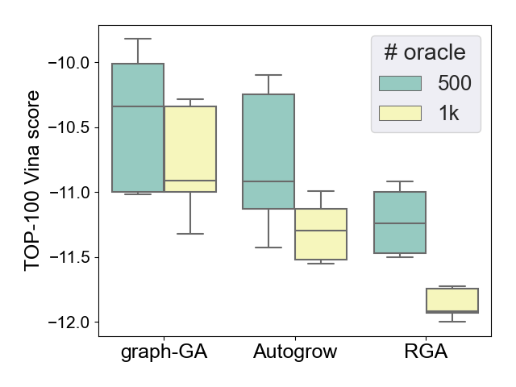
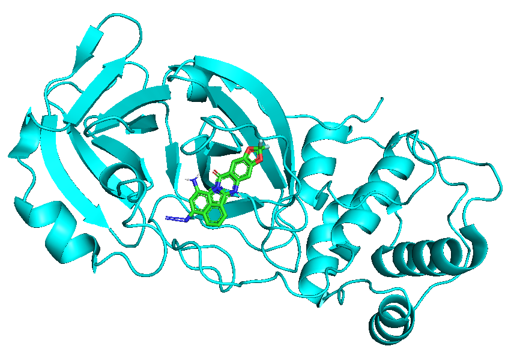

# Reinforced Genetic Algorithm for Structure-based Drug Design


This blog is written to introduce our recent NeurIPS 2022 paper [1]: Reinforced Genetic Algorithm for Structure-based Drug Design. 


The paper proposes a reinforcement learning-based genetic algorithm for structure-based drug design. 
This is the first successful attempt to use a neural model to guide the crossover and mutation operations in a genetic algorithm to suppress random-walk behavior and explore the chemical space intelligently. 
The following figure illustrate the difference between genetic algorithm and reinforced genetic algorithm. 


<p align="center"></p>


## Problem: structure-based Drug Design


Rapid drug discovery that requires less time and cost is of significant interest in pharmaceutical science. Structurebased drug design (SBDD) that leverages the three-dimensional (3D) structures of the diseaserelated proteins to design drug candidates is one primary approach to accelerate the drug discovery processes with
physical simulation and data-driven modeling. According to the lock and key model, the molecules that bind tighter to a disease target are more likely to expose bioactivity against the disease, which has been verified experimentally. 
As AlphaFold2 has provided accurate predictions to most human proteins [3], SBDD has a tremendous opportunity to discover new drugs for new targets that we cannot model before [2]. 


## Traditional genetic algorithm (GA)

Traditional combinatorial optimization methods such as genetic algorithms (GA) have demonstrated state-of-the-art performance in various molecular optimization tasks. However, they do not utilize protein target structure to inform design steps but rely on a random-walk-like exploration, which leads to unstable performance and no knowledge transfer between different tasks despite the similar binding physics.


## Reinforced genetic algorithm (RGA)


To achieve a more stable and efficient SBDD, we propose Reinforced genetic algorithm (RGA) that uses neural models to prioritize the profitable design steps and suppress random-walk behavior. 
The neural models take the 3D structure of the targets and ligands as inputs and are pre-trained using native complex structures to utilize the knowledge of the shared binding physics from different targets and then fine-tuned during optimization. 
Specifically, we propose an evolutionary Markov decision process (EMDP) that reformulates an evolutionary process as a Markov decision process, where the state is a population of molecules instead of a single molecule. 


We elaborate essential components for evolutionary Markov decision process as follows. 

- **State Space** We define the population at the t-step generation. A state includes population of candidate molecules and their 3D poses docked to the target, fully observable to the RL agent. At the beginning of the EMDP, we randomly select a population of candidate molecules and use docking simulation to yield their 3D poses as the initial state. 


- **Action Space** The actions in an EMDP are to conduct the two evolutionary steps: crossover and mutation, in a population. As applying the crossover and mutation steps are deterministic, the actions in an EMDP focus on selecting parents and mutation types. Upon finish the action, we could obtain offspring pool. 

- **State Transition Dynamics**  The state transition in an EMDP is identical to the evolution in an evolutionary process. Once we finish the actions and obtain the offspring pool, we apply molecular quality filters to filter out the ones unlikely to be drug and then select the most promising $K$ to form the parent set for the next generation. 

- **Reward** We define the reward as the binding affinity change (docking score). The actions leading to stronger binding score would be prioritized. 


## Experiment


**Optimization ability** 
We report the optimization performance of all the methods as follows. 
We evaluate all the methods on all targets and report each metric's mean and standard deviations across all targets. 
Arrows indicate the direction of better performance. 
For each metric, the best method is underlined and the top-3 methods are bolded. 
RGA-pretrain and RGA-KT are two variants of RGA that without pretraining and without training on different target proteins, respectively. 
Our result shows reinforced genetic algorithm (RGA) achieves the best performance in TOP-100/10/1 scores among all methods we compared. Compared to traditional genetic algorithm (Autogrow 4.0 [2]), RGA's better performance in docking score demonstrates that the policy networks contribute positively to the chemical space navigation and eventually help discover more potent binding molecules.


<p align="center"></p>


**Sample efficiency** In SBDD, the oracle functions are expensive molecular simulations, robustness to random seeds is essential for improving the worst-case performance of algorithms. One of the major issues in traditional GAs is that they have a significant variance between multiple independent runs as they randomly select parents for crossover and mutation types. To examine this behavior, we run five independent runs for RGA, Autogrow 4.0 and graph-GA (three best baselines, all are GA methods) on all targets and plot the standard deviations between runs. As shown in the following figure, with policy networks guiding the action steps, we observed that the random-walk behavior in Autogrow 4.0 was suppressed in RGA, indicated by the smaller variance. Especially in the later learning phase (after 500 oracle calls), the policy networks are fine-tuned and guide the search more intelligently. This advantage leads to improved worst-case performance and a higher probability of successfully identifying bioactive drug candidates with constrained resources.


<p align="center"></p>


**Example** We visualize one designed ligand with optimal affinity for closer inspection and find both ligands bind tightly with the targets. 

<p align="center"></p>


We have open-sourced our code in https://github.com/futianfan/reinforced-genetic-algorithm. 
The code can be run in one bash command line after setting conda environment.  

## conda 

### setup conda environment
```bash
conda create -n autogrow --file rga.yml 
```

### activate conda environment

```bash
conda activate autogrow 
```

## run SBDD

```
python RGA.py \
    --number_of_mutants_first_generation 50 \
    --number_of_crossovers_first_generation 50 \
    --number_of_mutants 50 \
    --number_of_crossovers 50 \
    --top_mols_to_seed_next_generation 50 \
    --number_elitism_advance_from_previous_gen 50 \
    --number_elitism_advance_from_previous_gen_first_generation 10 \
    --diversity_mols_to_seed_first_generation 10 \
    --diversity_seed_depreciation_per_gen 10 \
    --num_generations 10 \
    --mgltools_directory ./mgltools_x86_64Linux2_1.5.6/ \
    --number_of_processors -1 \
    --scoring_choice VINA \
    --LipinskiLenientFilter \
    --start_a_new_run \
    --rxn_library click_chem_rxns \
    --selector_choice Rank_Selector \
    --dock_choice VinaDocking \
    --max_variants_per_compound 5 \
    --redock_elite_from_previous_gen False \
    --generate_plot True \
    --reduce_files_sizes True \
    --use_docked_source_compounds True  
```


## References

[1] Tianfan Fu*, Wenhao Gao*, Connor W. Coley, Jimeng Sun. Reinforced Genetic Algorithm for Structure-based Drug Design. Neural Information Processing Systems (NeurIPS) 2022. 

[2] Spiegel, J. O. and Durrant, J. D. Autogrow4: an opensource genetic algorithm for de novo drug design and
lead optimization. Journal of cheminformatics, 12(1): 1–16, 2020.

[3] Jumper, John, et al. "Highly accurate protein structure prediction with AlphaFold." Nature 596.7873 (2021): 583-589. 


